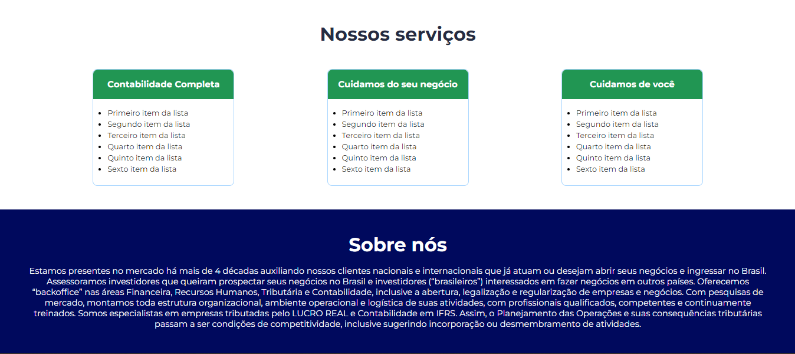
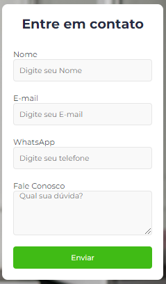

<h1 align="center"> Dev Contábil </h1>

 
 

<h4 align="center">Projeto de Homepage  responsiva.</h4>

 

<h4 align="center">Baseada originalmente em uma estrutura para versão desktop, a página foi desenvolvida em proposta a um layout de uma landing page que faz a 
apresentação de uma determinada corporação explanando conteúdos como serviços pretados, apresentação e habilita um formulário para contato do usuário 
direto com a organização. </h4>

 
 
<h2 align="center">Resultado:</h2>

<label>Imagem da parte superior da página.</label>
 

<label>Imagem da parte inferior da página.</label>
 

<label>Imagem do parte formulário sendo apresentado após o click em Contato.</label>
 

<label> Imagem do formulário.</label>
 

 

<h2 align="center">Tecnologias utilizadas no Projeto:</h2>

 

 

 

 
  

<h2 align="center">Fase do Projeto:</h2>

 <b>Status do Projeto:</b> Concluido :heavy_check_mark:

